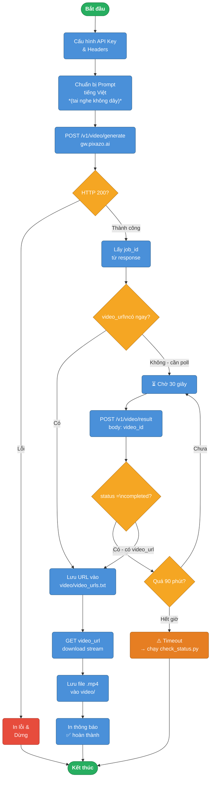

# AI Marketing – Tạo Video Quảng Cáo bằng Pixazo Sora API

## Mô tả dự án
Dự án này sử dụng **Pixazo Sora Video API** để tự động tạo video marketing bằng AI, tải video về máy và lưu trữ có tổ chức.

---

## Cấu trúc thư mục

```
AI Marketing/
├── testapi.py          # Script chính: tạo & tải video
├── README.md           # Tài liệu dự án (file này)
└── video/
    ├── video_urls.txt  # Log các URL video đã tạo (kèm timestamp)
    └── *.mp4           # Các file video được tải về
```

---

## Yêu cầu hệ thống

| Thành phần | Phiên bản |
|---|---|
| Python | 3.8+ |
| requests | >= 2.28 |

Cài đặt thư viện:
```bash
pip install requests
```

---

## Cấu hình

Mở `testapi.py` và cập nhật biến sau nếu cần:

```python
API_KEY = "your_pixazo_api_key_here"
```

> **Bảo mật:** Khuyến nghị dùng biến môi trường thay vì hardcode key:
> ```bash
> export Pixazo_API="your_key"
> ```
> rồi trong code: `API_KEY = os.getenv("Pixazo_API")`

---

## Sơ đồ luồng hoạt động



---

## Cách chạy

```bash
python testapi.py
```

### Luồng hoạt động:

1. **Gửi yêu cầu** tạo video đến Pixazo API với prompt tiếng Việt.
2. **Polling trạng thái** bằng `POST /video/result` với `{"video_id": "..."}` mỗi 30 giây (tối đa 90 phút).
3. **Lưu URL** vào `video/video_urls.txt` kèm timestamp.
4. **Tải video** `.mp4` vào thư mục `video/`.

> **Lưu ý:** Endpoint kiểm tra trạng thái là **POST** `https://gateway.pixazo.ai/sora-video/v1/video/result`
> với body `{"video_id": "<id>"}` — **không phải** GET `/video/status/{id}`.

---

## Nội dung video được tạo

**Chủ đề:** Quảng cáo **Tai nghe không dây cao cấp** (tiếng Việt, có người đóng)

**Prompt:**
> Một video marketing chuyên nghiệp về tai nghe không dây cao cấp. Cảnh quay studio sáng đẹp, một người phụ nữ trẻ Việt Nam tự tin đeo tai nghe, mỉm cười, nói chuyện điện thoại và thưởng thức âm nhạc. Camera zoom vào chi tiết tai nghe: thiết kế sang trọng, đệm tai mềm mại, logo nổi bật. Chữ tiếng Việt xuất hiện: 'Âm thanh đỉnh cao – Kết nối không giới hạn'. Màu sắc hiện đại, nhạc nền sôi động, phong cách quảng cáo thương mại.

**Thông số:**
- Độ phân giải: `1280×720` (HD)
- Thời lượng: `8 giây`

---

## Output mẫu

```
⏳ Đang gửi yêu cầu tạo video...
Phản hồi ban đầu: { "job_id": "abc123", ... }
🔄 Job ID: abc123. Đang chờ video hoàn thành...
  [01] Trạng thái: processing
  [03] Trạng thái: completed
✅ Video đã sẵn sàng!
🔗 URL video: https://cdn.pixazo.ai/.../output.mp4
📝 Đã lưu URL vào: video/video_urls.txt
⬇️  Đang tải video về: video/headphone_marketing_1711612800.mp4 ...
🎬 Đã lưu video: video/headphone_marketing_1711612800.mp4
```

---

## Lưu ý

- Mỗi lần chạy sẽ tạo một file `.mp4` mới với timestamp trong tên file.
- File `video_urls.txt` tích lũy tất cả URL theo thời gian, không bị ghi đè.
- Nếu API không hỗ trợ endpoint `/status`, hãy kiểm tra docs Pixazo để cập nhật `STATUS_URL`.
